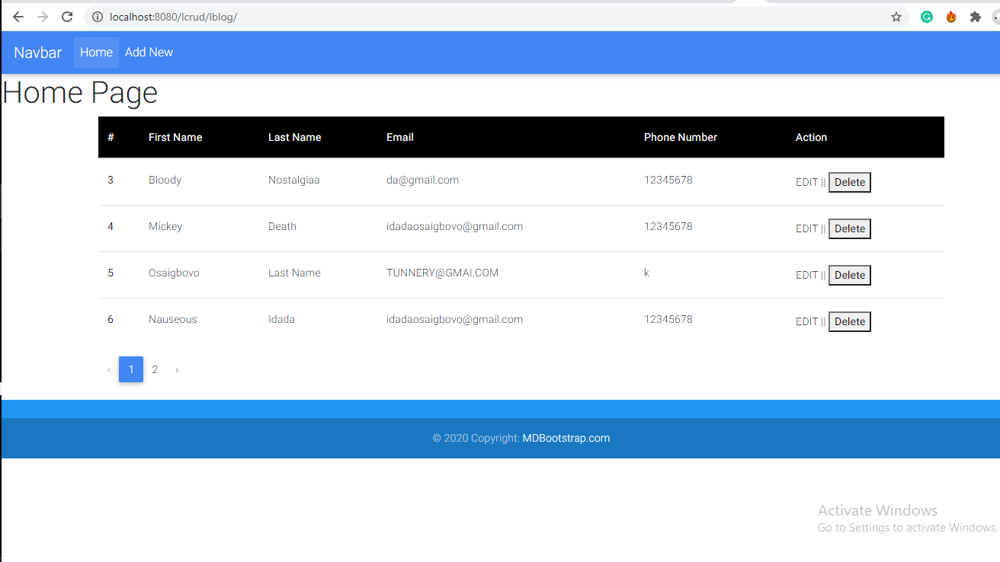

#LARAVEL CRUD
I used MD Bootstrap for the user interface.
A simple CRUD operation with laravel.
Creating a table, its schema and populating it. 
Creating a Model, interacting with the Controller and displaying in a View. 
Fully MVC

